# 电脑优化

# C盘清理

## 一. 桌面搬家

### 1. 打开此电脑，右键桌面（Desktop）

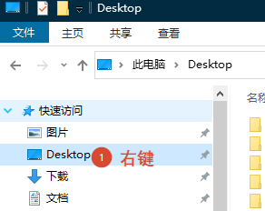

### 2. 点属性

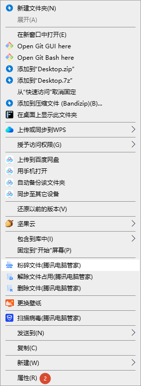

### 3. 点上面位置 -> 移动 -> 选择一个相对空的盘 -> 选择文件夹

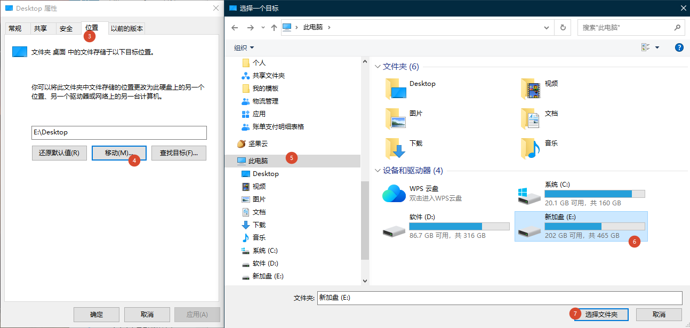

### 4. 点应用

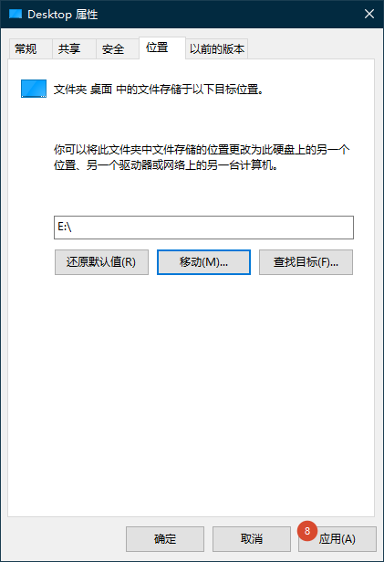

### 5. 是

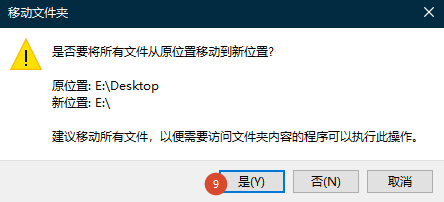

### 6. 是

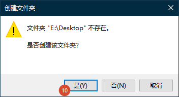

### 7. 点应用，待移动完毕

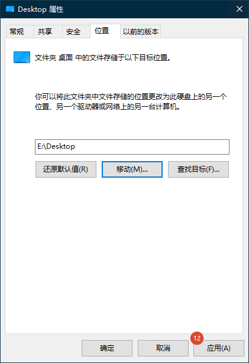

### 8. 文档和下载这两个地方也相对比较占空间，可以参考上面步骤移动到其他磁盘

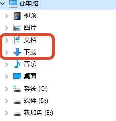

## 二. 更换聊天软件文件存储位置

### 1. 企点

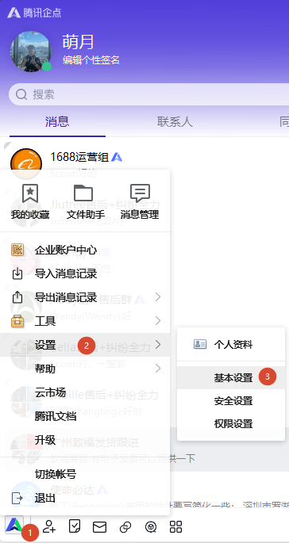

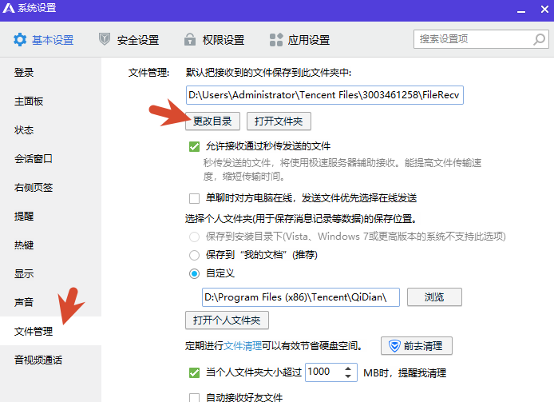

### 2. 微信

1. 点设置

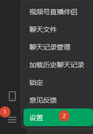

2. 更改存储位置到其他磁盘

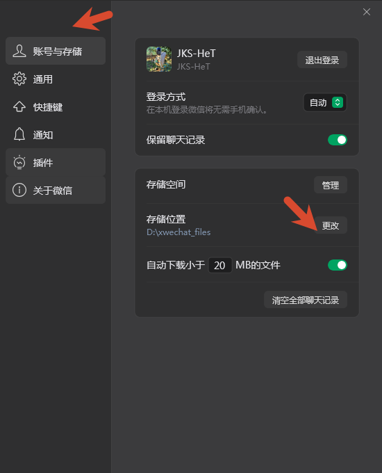

## 三. 大文件清理

### 1. 企点

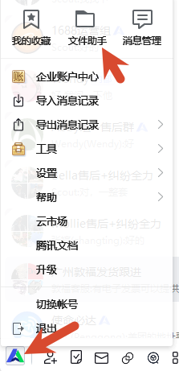

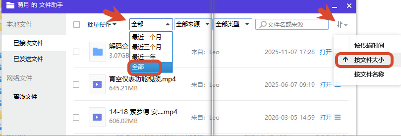

3. 按需删除没有用的大文件（需要打开文件夹手动删除），删完后回收站也需要清空

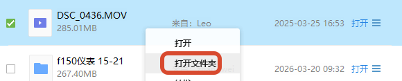

### 2. 微信

按需删除即可

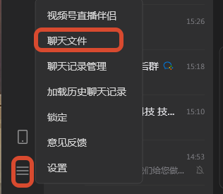

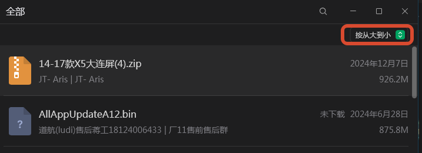

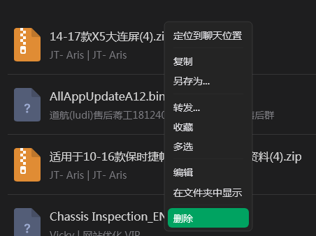